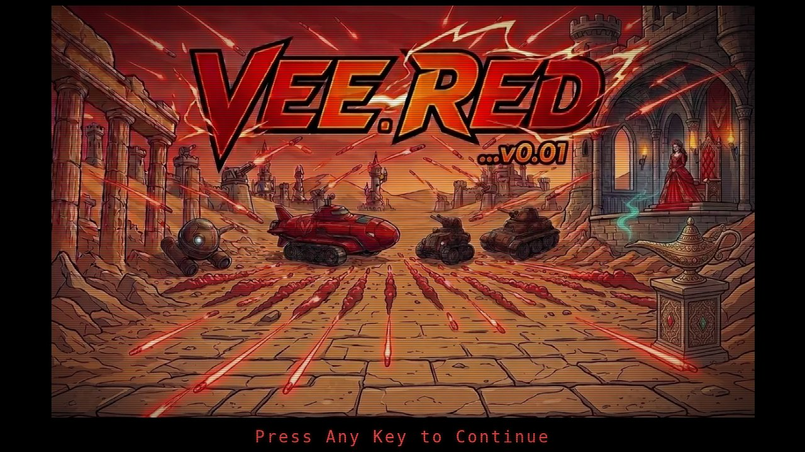

# Veered Menu: DOS-Style Browser Game Launcher (Veered menu)

**Play it now: [veered.org](https://veered.org)**



The front page of veered.org: a launcher for the Veered multiplayer browser games,
styled after a DOS-era text menu, plus an "Oversimplified Breakout" where clearing a
row of bricks launches that game.

## Please test before relying on it

This is shared as-is, with no warranty. It works on my own computers, but your system,
settings and software versions may differ, so please try it in a safe setting first.
If something doesn't work, you can ask Claude (or another AI coding assistant) to look
into it, and I'd appreciate hearing what you found and how you fixed it. You are also
welcome to just let me know at support@veered.org, and I'll look into it.

## What is in it

- `public/index.html`: the menu. It renders a real 80x25 character grid in the IBM
  VGA 16-colour palette. Keys: up/down, Enter, 1-4, H for help. A title splash is
  picked at random on each load.
- `public/breakout.html`: the Breakout launcher. Arrow keys or the mouse move the
  paddle, 1-3 launch a game directly, Esc returns to the menu.
- `public/vee-badge.js`: a one-line include for game pages. It adds the Veered
  favicons and a small corner emblem that links back to the menu:

  ```html
  <script src="https://veered.org/vee-badge.js" data-corner="top-right" defer></script>
  ```

  `data-corner` takes `top-left`, `top-right`, `bottom-left` (the default) or `bottom-right`.

The games themselves live in their own repositories:
[merlot](https://github.com/veered-org/merlot),
[swarm](https://github.com/veered-org/carmine-swarm) and
[maroon-isles-quest](https://github.com/veered-org/maroon-isles-quest).

## Run it yourself

The site is static. Serve `public/` with any web server, for example:

```bash
python3 -m http.server 8000 --directory public
```

To deploy it as a Cloudflare Worker (assets only), use Node.js 22 or later and run
`npm install` then `npx wrangler deploy`. To serve it on your own hostname, uncomment the
`[[routes]]` block in `wrangler.toml`. To point the menu at your own copies of the
games, edit the `ITEMS` array in `index.html` and the `GAMES` array in `breakout.html`.

## Credits and licenses

- Code: MIT. See [LICENSE](LICENSE).
- Splash art, logo and icons (`*.webp`, `*.png`, `favicon.ico`) are AI-generated
  images, edited by hand. [CC BY 4.0](https://creativecommons.org/licenses/by/4.0/);
  credit "Veered".
- Sounds are generated in the browser with the Web Audio API. No fonts are bundled.
- Written with AI assistance (Claude).
